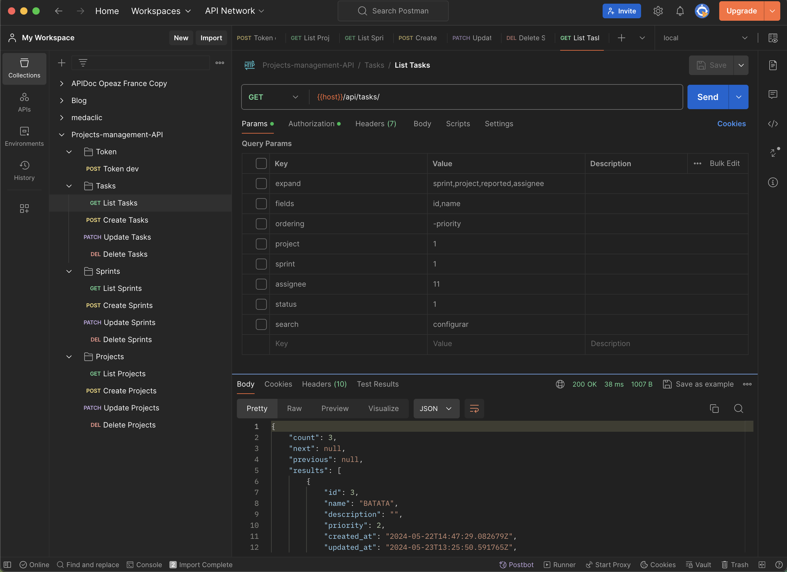
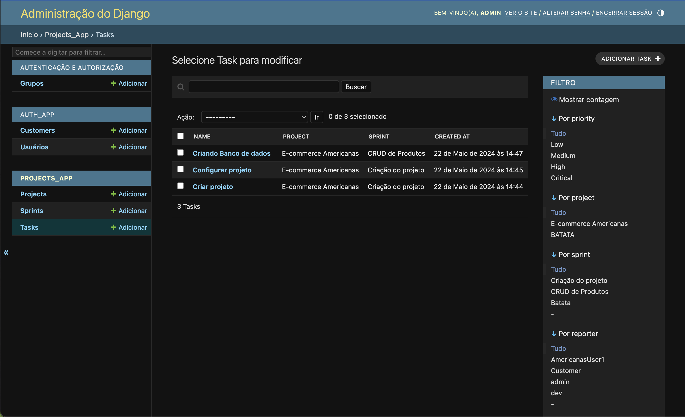

# Project-Management-API
This is a Django REST API, the backend of a project management system.

## Setting up project
1. With python3.12.2 installed. Install the requirements:
    ```bash
    pip install -r requirements.txt
    ```
    OBS: You can use a `virtualenv` or `pyenv` to install the requirements if you want.

2. Install [postgresql 14](https://www.digitalocean.com/community/tutorials/how-to-install-postgresql-on-ubuntu-20-04-quickstart-pt) with the following configurations:
    ```
    user: postgres
    password: postgres
    database: project-management
    ```
    - If your postgres is already installed, just create a database named `project-management`.
        ```bash
        createdb project-management -U postgres
        ```
    OBS: If you want to use another database settings, you must create and change the database variables in `.env` file (copy it if from [.env.dev](./.env.dev) file).


3. Run the migrations:
    ```bash
    python manage.py makemigrations && python manage.py migrate
    ```

4. Create a superuser:
    ```bash
    python manage.py createsuperuser
    ```

5. Check if everything is working
    ```bash
    python manage.py runserver
    ```
Go to [localhost:8000/admin](http://localhost:8000/admin/) and check if it's working

## Running tests and coverage
To run the tests:
```bash
./manage.py test
```

To get coverage report:
```bash
coverage run --source='.' manage.py test
coverage report
```

## Using the API
You can import the [Postman collection](./Projects-management-API.postman_collection.json) to test the API.

Just run the project and use the HOST variable in the postman collection to `localhost:8000`.

```bash
./manage.py runserver
```

Know that you can use `filters`, `sorting`, `searches`, `expanding fields`, `asking for just a few fields`... etc. Just look at the postman collection in the listing endpoints in the `params` tab. Some use cases are documented there.



## Admin Page
You can access the admin page to manage the data in the database. Just go to [localhost:8000/admin](http://localhost:8000/admin/).

Try to create some users and customers before start using the API.

